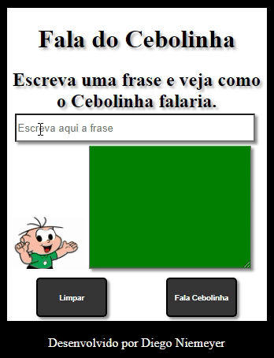

<h1 align="center"> FALA DO CEBOLINHA</h1>

<h2 align="center">Descrição do projeto </h2>

 Projeto Desenvolvido para treinar as Habilidades em HTML, CSS E JAVASCRIPT.

 Foi criada uma estrutura de repetição para trocar o "R" pelo "L" e usado o capitalize para transformar as iniciais de cada palavra em letras maiúsculas.  

 

Vídeo: 

 

 

<h2 align="center"> Acesso ao projeto </h2>

 Você pode acessar o projeto final clicando aqui: https://dniemeryers.github.io/fala-cebolinha/ 

 
<h2 align="center"> Tecnologias utilizadas </h2>

 
<h2 align="center"> Pessoa desenvolvedora do projeto </h2>

|  Diego Niemeyer |
| :---: |